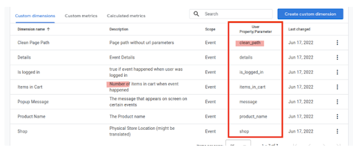
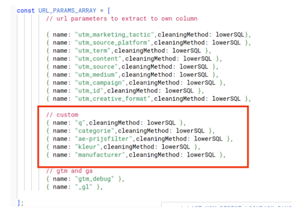
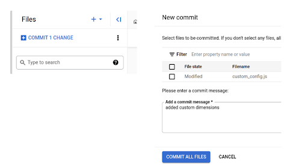
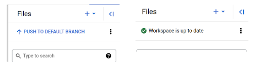
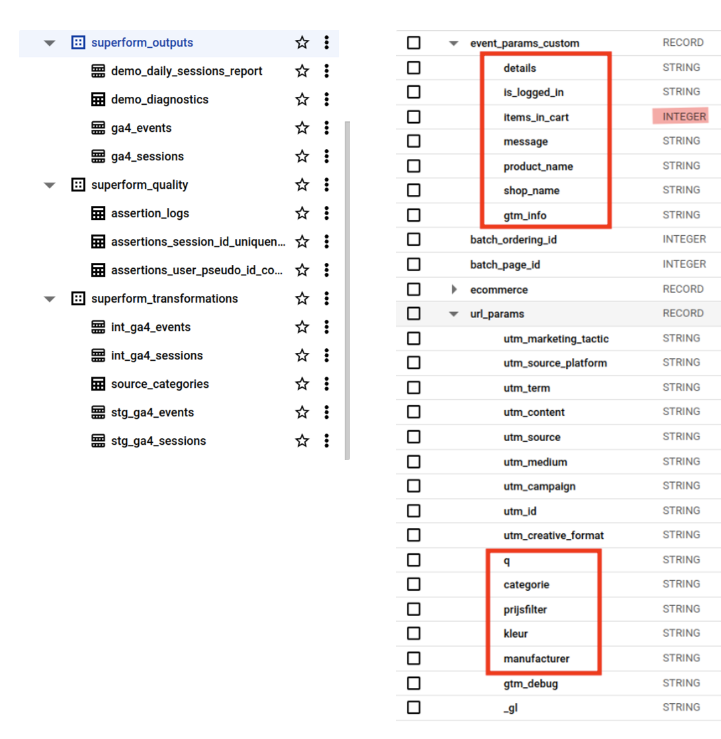

# So, I’ve installed ga4dataform.. now what?
## Browse to the files
On the repository page, select the created repository you just created, and browse to the Development workspace

Browse to includes/custom_config.js and adjust the parameters to your needs

## Add some customisations
Now, you can configure custom parameters you want in your events dataset. Let’s look at GA4 and just use those:

We see 7 custom dimensions, of which 6 are needed
clean_path is already in the model (as page.path)
- 6 are going to be configured:
  - 5 as string
    - 1 as number (int)

I will rename the event param shop to become the column name shop_name

`
const CUSTOM_PARAMS_ARRAY = [
  // outside the core ones
  { name: "details", type: "string" },
  { name: "is_logged_in", type: "string" },
  { name: "items_in_cart", type: "int" },
  { name: "message", type: "string" },
  { name: "product_name", type: "string" },
  { name: "shop", type: "string", renameTo: "shop_name" },
];
`

This website uses q as search term url parameter, and some other URL parameters to indicate filters. Let’s add those:

## Save your changes
When making changes, you have to test them (which we’re not going to do now, haha) and when it’s all working: push them into production.
First commit, then push
Commit

You've pushed successfully when the workspace is up to date and the green checkmark shows

## Run the model
Under “releases and scheduling”, you can find the preconfigured “production” configuration.

Click start execution, and fill in the popup

Click "Start Execution" now.

## Check for success
Under “workflow execution logs” you can check if the model has ran succesfully

In this case, there is an error! Click “VIEW DETAILS”

If we scroll down to row 629 we see that”ae-prijsfilter” is an invalid column name. Oops! We should have tested..

Back to the source. Let’s rename the column to prijsfilter

`
       // custom
    { name: "q",cleaningMethod: lowerSQL },
    { name: "categorie",cleaningMethod: lowerSQL },
    { name: "ae-prijsfilter",cleaningMethod: lowerSQL, renameTo: 'prijsfilter' },
    { name: "kleur",cleaningMethod: lowerSQL },
    { name: "manufacturer",cleaningMethod: lowerSQL },
`

## Remember
commit
push

## Start new execution
Again
production
all tags
run with full refresh

## Check for success - part 2
Go to the workflow execution logs, and click REFRESH until you’re tired
If all check marks are green, the model ran successfully!

## Check Big Query
Go to Bigquery, and you should see the new tables.
Currently, the customisations are in the _outputs/ga4_events table in the schema under

## Connect Looker Studio to the sessions table
Open Looker Studio
Add data source, choose Big Query
Browse to the demo_daily_sessions_report table
Use session_date as date range dimension

Click ADD
# Now go wild!

